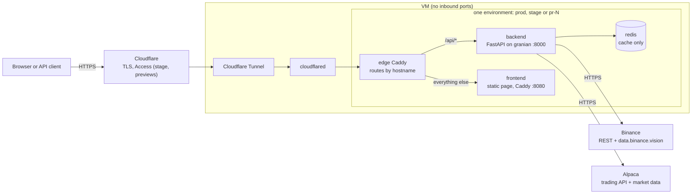

# Architecture

The CandleStack backend is one Python service: a FastAPI application that serves the HTTP API
under `/api`. In this milestone it has two modules: `core` (configuration, logging, errors,
Redis and HTTP clients, health) and `data` (market data: instrument catalog and candles from
Binance and Alpaca, see [data.md](data.md)). It stores nothing: the sources are the truth and
Redis is a cache that can be lost at any time.

## Runtime

Every environment (prod, stage, `pr-<N>` previews) runs the same three containers on one VM.
Deployment, hosts and secrets are described in [infra/README.md](../infra/README.md).

| Container | Image | Notes |
| --- | --- | --- |
| `backend` | `ghcr.io/candlestack-fei-stu/candlestack/backend` | calls Binance and Alpaca; gets the environment's Alpaca keys at deploy time |
| `frontend` | `ghcr.io/candlestack-fei-stu/candlestack/frontend` | placeholder page until the real frontend exists |
| `redis` | `redis:8-alpine` | private network of the environment, no persistence, `allkeys-lru` |

## HTTP surface

| Path | What |
| --- | --- |
| `GET /api/health` | liveness + Redis; used by deploys and the ops page; not versioned |
| `GET /api/health/sources` | reachability of Binance and Alpaca (cached 60 s) |
| `GET /api/v1/data/...` | instruments and candles, see [data.md](data.md) |
| `GET /api/v1/docs` | API reference (Scalar); public on prod |
| `GET /api/v1/openapi.json` | OpenAPI schema; snapshot committed as [openapi.json](openapi.json) |

- Responses are JSON. Pydantic response models serialize themselves; the candles body, up to
  50000 candles, is written with orjson straight from the Polars columns (its model only
  documents it). Errors are RFC 9457 `application/problem+json` with
  `type` `https://candlestack.tech/problems/<slug>`, `title`, `status`, a `detail` that says
  which limit fired and what to do, and extension fields. Request validation errors use slug
  `validation` (422).
- Every response carries `X-Request-ID` and `Server-Timing: app;dur=<ms>` (the app's time
  until the response started), so response times can be measured from outside.
- Logs: one JSON object per line on stdout (`ts`, `level`, `logger`, `msg`); the access line
  adds `method`, `path`, `status`, `duration_ms`, `request_id` (the `CF-Ray` header, else a
  random hex).

## Modules

A module is a subpackage of `candlestack` under `backend/src/candlestack/`.

| Module | Status | Responsibility |
| --- | --- | --- |
| `core` | now | settings, logging, problem errors, Redis and HTTP clients, health endpoint |
| `data` | now | instrument catalog, candles, sessions, cache, source adapters, rate limits |
| `preprocessing` | later | Renko, Kagi, time windows, normalization, segmentation |
| `models` | later | upload `.keras` models, validate input/output shapes, run inference |
| `postprocessing` | later | turn predictions into signals: thresholds, smoothing, holding period, sizing, risk limits |
| `metrics` | later | unified metrics and charts of one run |
| `experiments` | later | assemble the three layers into runs, store and compare them |
| `admin` | later | team-only administration (roles, audit) under `/admin` |

Folders for later modules are created when their work starts, not before.

## Import rules

- Dependencies point one way: `experiments` -> pipeline layers (`preprocessing`, `models`,
  `postprocessing`, `metrics`) -> `data` -> `core`. `core` imports no other module.
- Another module is imported only through its package root:
  `from candlestack.data import DataService`, never `from candlestack.data.sources import ...`.
  The package root's `__init__.py` is the module's public API.
- `candlestack.main` (builds the app) and `candlestack.openapi` (schema snapshot) wire the
  modules together and may import any module root.
- Checked by import-linter (`uv run lint-imports`, contracts in `backend/pyproject.toml`) in
  the CI `lint` job.

## Stack

| Concern | Choice | Why |
| --- | --- | --- |
| Language | Python 3.13 | the team's language and the ML ecosystem the later modules need |
| Packaging | uv, committed `uv.lock` | fast, reproducible installs (`uv sync --locked`) in dev, CI and images |
| Web | FastAPI, Pydantic v2, pydantic-settings | typed validation and an OpenAPI schema from the same code; typed env config |
| Server | granian | fast Rust ASGI server, one command for prod and `--reload` in dev |
| JSON | orjson | serializes large numeric arrays (up to 50000 candles) quickly |
| Data frames | Polars | fast columnar processing, Arrow-native; cache blobs are Arrow IPC + zstd |
| Cache | Redis with `redis[hiredis]` asyncio | one store for cache blobs, locks and rate-limit counters |
| HTTP client | httpx (async), timeouts always set | async calls to the sources; mocked in tests with respx |
| API docs | scalar-fastapi at `/api/v1/docs` | readable reference with request examples; Swagger and ReDoc disabled |
| Time zones | stdlib `zoneinfo` + `tzdata` | DST-correct New York sessions even in slim images without system tz data |
| Lint and format | ruff | one fast tool for linting, import sorting and formatting |
| Types | ty, exact version pinned | fast type checker; pinned so a new release cannot turn CI red by itself |
| Boundaries | import-linter | keeps the module rules above enforced, not just written down |
| Tests | pytest, pytest-xdist, anyio plugin, respx | parallel runs, async tests, no real network in unit and integration tests |

## Configuration

Environment variables, read by pydantic-settings without a prefix. All are documented in
[`.env.example`](../.env.example).

| Variable | Default | Meaning |
| --- | --- | --- |
| `APP_ENV` | `local` | `local`, `test`, `stage`, `prod`, `pr-<N>` |
| `APP_VERSION` | `dev` | deployed version (`main-<sha>`, `v0.2.0`, `pr-<N>-<sha>`) |
| `APP_COMMIT` | `unknown` | commit sha, baked into the image at build time |
| `LOG_LEVEL` | `INFO` | |
| `REDIS_URL` | `redis://localhost:6379/0` | |
| `ALPACA_KEY_ID`, `ALPACA_SECRET_KEY` | empty | Alpaca paper account keys (whitespace stripped) |
| `ALPACA_API_URL` | `https://paper-api.alpaca.markets` | assets, calendar, clock |
| `ALPACA_DATA_URL` | `https://data.alpaca.markets` | bars |
| `BINANCE_API_URL` | `https://api.binance.com` | REST |
| `BINANCE_DATA_URL` | `https://data.binance.vision` | public archives |
| `CANDLES_MAX` | `50000` | max candles in one `/candles` response |
| `CLIENT_RATE_LIMIT` | `60` | candle requests per minute per client IP; `0` disables |
| `ALPACA_RATE_LIMIT` | prod `150`, stage `60`, `pr-*` `30`, else `60` | our Alpaca request budget per minute |
| `BINANCE_WEIGHT_LIMIT` | `1000` | our Binance REST weight budget per minute per environment |

## Not in this milestone

- Postgres (no stored data yet)
- Celery (job queue and worker)
- TensorFlow / Keras
- admin, roles, audit log
- the real frontend (the placeholder page stays)
- user data upload (no CSV import)
- live data (streaming, websockets)
- Kubernetes, Terraform
- a coverage gate in CI

## Decisions

| Decision | Why |
| --- | --- |
| Modular monolith, one package, boundaries checked by import-linter | one image and one deploy for a small team; the boundaries still hold |
| No database; Redis as a disposable cache (no persistence, `allkeys-lru`) | market data comes from the sources on demand; losing Redis costs only refetch time |
| One source per market, never mixed in one series: Binance spot for crypto, Alpaca IEX for US stocks | consistent data; both are free |
| Full history fetched lazily on request, catalog cached 24 h and refreshed in the background | no ingestion pipeline and no scheduler to run |
| Stocks use the regular session only (09:30-16:00 New York, calendar from Alpaca) | comparable candles; extended-hours IEX data is thin |
| Same timeframes for both markets: `1m 5m 15m 1h 4h 1d` | experiments can switch markets without changing the pipeline |
| UTC epoch seconds everywhere, candle label = open time, `start` inclusive, `end` exclusive | no time zone ambiguity at the API; New York time exists only in session math |
| Gaps are reported, never filled | filled candles would be invented prices |
| Explicit limits instead of silent truncation (50000 candles, per-IP and per-source rate limits) | the client always gets exactly what it asked for or an error saying what to change |
| A fingerprint over every candle set | later experiments can detect that a source changed its data |
| Prod API and docs public (per-IP rate limit); stage and previews behind Cloudflare Access | anyone can try the released API without an account; unreleased builds stay team-only |
| granian instead of uvicorn, ty instead of mypy, Polars instead of pandas | faster tools with the same role |
| Coverage and TDD are team conventions, not CI gates | CI stays fast; test quality is checked in review |
