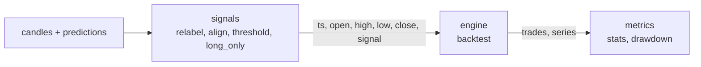

# Backtest engine contract

The backtest answers one question: had we traded on a model's predictions, what would have
happened? It turns candles and predictions into trades, an equity curve and statistics. This
document is the contract for the code behind it: the `signals`, `engine` and `metrics` modules
and the `candlestack-bt` command in `cli`, as the code does it now. Architecture and module
rules: [architecture.md](architecture.md). Candles: [data.md](data.md).

## Where the engine sits



| Module | Public names | Job |
| --- | --- | --- |
| `signals` | `relabel`, `align`, `AlignReport`, `threshold`, `long_only` | put predictions next to their candles and turn them into a signal of -1, 0 or +1 |
| `engine` | `backtest`, `Settings`, `Result`, `InvalidInput`, `ENGINE_VERSION` | the loop: candles and a signal in, trades and an equity series out |
| `metrics` | `stats`, `drawdown` | the statistics of one run and its drawdown curve |
| `cli` | `main` (the `candlestack-bt` command) | read files, call the three modules above in order, write the results |

- The three backtest modules are plain functions on Polars frames. They import no other module
  of the project, not each other and no server library; nothing imports `cli`.
  `uv run lint-imports` checks this (contracts in `backend/pyproject.toml`).
- They meet only through the column contracts below. In the code, only the command calls them
  one after the other; later `experiments` will too.

What is outside the engine on purpose:

| Concern | Where | Why |
| --- | --- | --- |
| how a prediction becomes long, short or flat (thresholds, long only; later smoothing, holding period) | `signals` | a new idea is a new signal function; the loop and its results stay the same |
| time labels and missing candles or predictions | `signals` (`relabel`, `align`) | the engine takes the rows as given; it only checks that `ts` increases |
| statistics, drawdown curve, annualization | `metrics` | a new statistic needs no new engine version |
| files, hashes of the inputs, the summary | `cli` | the engine reads and writes no files |
| what only one data set needs (the supervisor's close labels, his trades without the last open one) | his test, `tests/unit/engine/test_supervisor.py` | the engine stays general |

The loop is the part every result depends on, so it stays small, it is versioned
(`ENGINE_VERSION`) and it is the tech lead's area: a change to `candlestack/engine/`, its tests
or this document needs the tech lead's approval (`.github/CODEOWNERS`). Extend the backtest
through `signals` or `metrics`, not by changing the loop.

Not modelled in this version:

- position sizing: one position at a time, always the whole capital; a fractional signal is
  refused ("position sizing is not supported yet");
- leverage, margin and liquidation: the only limit is ruin (rule 8): once a position or a
  trade has lost the whole capital, the capital is 0 and the run stays flat;
- volume and liquidity: every order fills in full at its price; `volume` is ignored;
- borrowing costs, financing, dividends and several instruments in one run.

## Input

`backtest(frame, settings)` takes one Polars frame, one row per candle.

| Column | Type | Rule |
| --- | --- | --- |
| `ts` | any integer, cast to Int64 | UTC epoch seconds of the candle's open (as in [data.md](data.md#time)); none missing; each row after the previous one |
| `open`, `high`, `low`, `close` | any number, cast to Float64 | finite and above 0 |
| `signal` | any number, cast to Float64 | -1 (short), 0 (flat) or +1 (long); none missing |

- Other columns (`volume`, `prediction`, ...) are ignored.
- The engine does not sort and does not compare high and low with open and close; candles from
  the `data` module are checked for that already ([data.md](data.md#validation)).
- An empty frame gives empty trades and series with the schemas below.
- A frame that breaks a rule raises `InvalidInput` (a `ValueError`) before anything runs. The
  message names every broken rule, how many rows break it and the first one, for example:

  ```text
  Invalid backtest input: 1 row has a ts not after the previous row, first at row 2; 1 row has a fractional signal (position sizing is not supported yet), first at row 1.
  ```

## Settings

`Settings` is a frozen Pydantic model, so a stored run keeps the settings it ran with. An
unknown field or a value out of range raises a validation error (a `ValueError`).

| Field | Type | Default | Meaning |
| --- | --- | --- | --- |
| `fill` | `"next_open"` or `"signal_close"` | `"next_open"` | when a decision fills: at the open of the next candle, what a live run can do, or at the close of the candle that made it, the convention of the supervisor's results (optimistic: the decision and its fill see the same close) |
| `stop_loss` | number above 0 and below 1, or `None` | `None` | the loss that closes a position, as a fraction of its entry price: 0.05 is 5%; `None` for no stop |
| `fee_bps` | finite number, 0 or more | `0.0` | the fee of each leg, in basis points of its notional |
| `slippage_bps` | finite number, 0 or more | `0.0` | how far each fill lands from its price, against the trade, in basis points |

A basis point (bps) is 0.01%: 10 bps is a factor of 0.001.

## Output

`backtest` returns a `Result`, a frozen dataclass with `trades`, `series` and `engine_version`.
All numbers are float64 as computed, never rounded.

`trades`: one row per closed trade, in time order (there is at most one position at a time).

| Column | Type | Meaning |
| --- | --- | --- |
| `signal_ts` | Int64 | `ts` of the candle whose signal change made the decision |
| `open_ts` | Int64 | `ts` of the candle the entry filled on |
| `close_ts` | Int64 | `ts` of the candle the exit filled on |
| `side` | Int8 | +1 long, -1 short |
| `open_price` | Float64 | entry fill price, slippage included |
| `close_price` | Float64 | exit fill price, slippage included |
| `stop_price` | Float64 | the stop level; null without a stop |
| `exit_reason` | String | `signal`, `stop`, `gap`, `end` or `ruin` (see the rules) |
| `return` | Float64 | capital after the trade / capital before it - 1, costs included; below -1 only when the trade lost more than the capital, which then becomes 0 (rule 8) |
| `fees` | Float64 | the fees of both legs, as a fraction of the capital before the trade |
| `slippage_cost` | Float64 | what slippage cost the trade, as a fraction of the capital before it: the return at the prices before slippage, with the same fees, minus `return`; `fees + slippage_cost` is the full cost |

`series`: one row per input candle.

| Column | Type | Meaning |
| --- | --- | --- |
| `ts` | Int64 | the candle's `ts` |
| `signal` | Float64 | the input signal |
| `position` | Float64 | -1, 0 or +1: the side held after the candle's fills |
| `equity` | Float64 | the capital after the candle's fills, an open position marked at the candle's close; the run starts with 1.0 |

`engine_version` is `ENGINE_VERSION`, now `"0.2.0"` (see [ENGINE_VERSION](#engine_version)).

## Rules

These are the rules of `candlestack/engine/loop.py`, numbered as in its docstring. On each
candle the loop does four things, in this order:

1. `next_open` only: the order decided on the previous candle fills at this candle's open.
2. The stop of the position held now is checked.
3. If the signal differs from the previous candle's, the decision is acted on: `signal_close`
   fills it at this candle's close, `next_open` leaves an order for the next open.
4. A position worth 0 or less at this candle's close is closed there (ruin, rule 8); the
   candle's `position` and `equity` are recorded.

After the last candle, a position still open is closed at the last close. After a ruin the
loop does nothing more: every later candle is flat with an equity of 0.

The rules, the same for both fills:

1. **Only a change of the signal is a decision.** The first row is a warm-up: it sets the
   starting signal and can never be a change, so a signal of +1 from the first row opens
   nothing until it changes.
2. **Two fills.** `signal_close` fills a decision at the close of its candle; `next_open` at
   the open of the next candle. On that next candle the order fills first, at the open, and
   then the stop of the position now held is checked. A position the order closes at the open
   cannot gap out on that candle: it leaves with reason `signal`.
3. **A flip is two legs.** From +1 to -1 (or back) the position is closed and the new one
   opened at the same fill price, as two trades, each leg with its fee and slippage.
4. **Stop loss.**
   - The level comes from the actual entry price, slippage included:
     `entry * (1 - side * stop_loss)`, below the entry for a long, above it for a short.
   - On a candle the position already held at its open: an open at or beyond the level exits
     at that open (`gap`); otherwise a low (long) or high (short) at or beyond the level exits
     at the level (`stop`). Touching the level counts.
   - On its entry candle a `next_open` position can only touch the level (its open is the
     entry); a `signal_close` position is first checked on the next candle.
   - The stop comes before the signal of the same candle: on a candle that reaches the stop
     and changes the signal, the stop closes the position first, and the change then acts on
     the flat position, so a change to the other side opens it.
   - After a stop, only the next change of the signal opens a position again; a signal that
     stays at +1 after its long was stopped out does not buy back.
5. **Costs.** Slippage moves each fill price against the trade; the fee is a commission on each
   leg (see [Fees and slippage](#fees-and-slippage)). A trade's return is capital after /
   capital before - 1: `side * (exit / entry - 1) - fee * (1 + exit / entry)`. Its
   `slippage_cost` is the return at the prices before slippage minus that, so
   `fees + slippage_cost` is the return without costs, `side * (price_exit / price_entry - 1)`,
   minus the return.
6. **The last row.** A change on the last row opens nothing: with `signal_close` it may still
   close a position (reason `signal`), with `next_open` its order is never filled. A position
   still open after the last row is closed at the last close (reason `end`), with its exit fee
   and slippage. A `next_open` order from the row before the last still fills at the last open;
   its stop is checked on the last row like on any entry candle (only a touch counts there), so
   it can still exit by `stop`, and otherwise it ends at the last close.
7. **Equity.** Capital starts at 1.0, is always fully invested and compounds: after each trade
   it is multiplied by `1 + return`. A candle's `equity` is the capital after all its fills,
   with the open position marked at the candle's close:
   `capital * (1 + side * (close / entry - 1) - fee)`, where the entry fee is already paid and
   the exit's fee and slippage are not yet. `position` is the side held after the candle's
   fills, so the last row is always flat.
8. **Ruin.** The capital cannot go below 0:
   - when the equity of an open position, marked at a candle's close as in rule 7, is at or
     below 0, the position closes at that close, with its exit fee and slippage, and reason
     `ruin`;
   - when a closing trade's `return` is at or below -1, for example a gap through the stop or a
     short closed by the signal after its price doubled, nothing is left of the capital.

   Either way the capital becomes 0 (the trade's `return` stays as computed, at or below -1),
   no position opens again, not even the second leg of a flip or a `next_open` order already
   decided, and the `equity` of every later row is 0. Without a stop, a short is ruined once
   its price about doubles.

| `exit_reason` | When | Exit price before slippage |
| --- | --- | --- |
| `signal` | the signal changed to flat or to the other side | the fill price of the decision (`close` or next `open`) |
| `stop` | the low (long) or high (short) reached the stop level | the stop level |
| `gap` | the candle opened at or beyond the stop level | the candle's open |
| `end` | the position was still open after the last row | the last close |
| `ruin` | the position was worth 0 or less at a candle's close (rule 8) | that close |

The hand-made examples of each rule are in `backend/tests/unit/engine/test_rules.py`.

## Worked example

Five 30-minute candles from 2024-06-03 13:30 UTC (09:30 in New York), a stop loss of 5% and a
fee of 10 bps (`Settings(stop_loss=0.05, fee_bps=10)`, no slippage). The model goes long on
row 1 and stays long.

| Row | `ts` | open | high | low | close | signal |
| --- | --- | --- | --- | --- | --- | --- |
| 0 | 1717421400 | 100 | 101 | 99 | 100 | 0 |
| 1 | 1717423200 | 100 | 102 | 99.5 | 101 | +1 |
| 2 | 1717425000 | 102 | 104 | 101 | 103 | +1 |
| 3 | 1717426800 | 99 | 99.5 | 96 | 97 | +1 |
| 4 | 1717428600 | 97 | 98 | 96.5 | 98 | +1 |

With `fill="signal_close"`:

| Row | What happens | `position` | `equity` |
| --- | --- | --- | --- |
| 0 | warm-up: the starting signal is 0 | 0 | 1 |
| 1 | the signal changes from 0 to +1: long at the close, 101; stop level `101 * 0.95 = 95.95`; the entry fee is paid | 1 | `1 + (101 / 101 - 1) - 0.001 = 0.999` |
| 2 | the open (102) and the low (101) stay above the level | 1 | `1 + (103 / 101 - 1) - 0.001 = 1.018802` |
| 3 | the low, 96, stays above 95.95 | 1 | `1 + (97 / 101 - 1) - 0.001 = 0.959396` |
| 4 | no change; after the last row the long is closed at the last close, 98 (`end`) | 0 | `1 + return = 0.968327` |

The trade's return is
`98 / 101 - 1 - 0.001 * (1 + 98 / 101) = -0.029703 - 0.001970 = -0.031673`.

With `fill="next_open"` the same signal fills one candle later, at a higher price, so its stop
is higher too:

| Row | What happens | `position` | `equity` |
| --- | --- | --- | --- |
| 0 | warm-up | 0 | 1 |
| 1 | the signal changes: an order for the next open | 0 | 1 |
| 2 | the order fills at the open: long at 102; stop level `102 * 0.95 = 96.9`; on its entry candle only a touch counts, and the low, 101, is above it | 1 | `1 + (103 / 102 - 1) - 0.001 = 1.008804` |
| 3 | the open, 99, is above the level (no gap), but the low, 96, reaches it: out at 96.9 (`stop`) | 0 | `1 + return = 0.94805` |
| 4 | the signal is still +1, which is no change: no new long | 0 | 0.94805 |

The trade's return is `96.9 / 102 - 1 - 0.001 * (1 + 0.95) = -0.05 - 0.00195 = -0.05195`.

The two `trades` rows:

| Column | `signal_close` | `next_open` |
| --- | --- | --- |
| `signal_ts` | 1717423200 (row 1) | 1717423200 (row 1) |
| `open_ts` | 1717423200 (row 1) | 1717425000 (row 2) |
| `close_ts` | 1717428600 (row 4) | 1717426800 (row 3) |
| `side` | 1 | 1 |
| `open_price` | 101 | 102 |
| `close_price` | 98 | 96.9 |
| `stop_price` | 95.95 | 96.9 |
| `exit_reason` | `end` | `stop` |
| `return` | -0.031673 | -0.05195 |
| `fees` | 0.001970 | 0.00195 |
| `slippage_cost` | 0 | 0 |

`backend/tests/unit/engine/test_doc_example.py` runs this example, the slippage variant, its
statistics, the `InvalidInput` message under [Input](#input) and the command below with its
`run.json`, and compares them with what is printed here. Change both together.

## Fees and slippage

The two costs work differently:

- **Fee: a commission, nothing else.** Each leg pays `fee_bps` of its notional: the entry leg
  pays `fee * capital`, the exit leg `fee * capital * exit / entry` (the position's value at
  the exit). The trade's `fees` column is their sum as a fraction of the capital before the
  trade, `fee * (1 + exit / entry)`. The fee never changes a price.
- **Slippage: a worse price, nothing else.** With `s = slippage_bps * 0.0001` and `side` +1 or
  -1, an entry fills at `price * (1 + side * s)`, an exit (`signal`, `gap` or `end`) at
  `price * (1 - side * s)`, and a stop exit at `level * (1 - side * s)`. The stop level comes
  from the slipped entry price. `open_price` and `close_price` include slippage; `stop_price` is
  the level before the exit's slippage. Slippage never shows in `fees`; it shows in the prices,
  the return and `slippage_cost`: the return at the prices before slippage (the entry's fill
  price and the exit's fill price or stop level), with the same fees, minus the return, that is
  `side * (price_exit / price_entry - exit / entry)`.

The worked example with `fill="next_open"` and 10 bps of slippage as well
(`Settings(fill="next_open", stop_loss=0.05, fee_bps=10, slippage_bps=10)`):

- entry: `102 * 1.001 = 102.102`;
- stop level: `102.102 * 0.95 = 96.9969`, from the slipped entry, so above 96.9;
- the low of row 3 reaches it: exit at `96.9969 * 0.999 = 96.8999031`;
- return: `96.8999031 / 102.102 - 1 - 0.001 * (1 + 0.94905) = -0.05095 - 0.00194905`,
  which is -0.05289905;
- `fees` is 0.00194905: the commission only, a little less than without slippage because the
  exit leg is worth less;
- `slippage_cost` is 0.0019: before slippage the trade was in at 102 and out at the level,
  96.9969, so `96.9969 / 102 - 96.8999031 / 102.102 = 0.95095 - 0.94905`. With `fees` that is
  0.00384905, the return without costs, `96.9969 / 102 - 1 = -0.04905`, minus the return;
- `equity` is 1, 1, 1.007795, 0.947101, 0.947101.

## Signals

| Function | What it does |
| --- | --- |
| `relabel(frame, timeframe_seconds, column="ts")` | turns close-time labels into open-time labels: `column - timeframe_seconds`, as Int64. The supervisor labels a 30-minute candle and its prediction by the candle's close; the engine and `align` expect its open. Raises `ValueError` when the column is missing, not integer or has a missing value, or the timeframe is not a positive int |
| `align(candles, predictions, *, model=None, strict=True)` | the candles from the model's first to its last prediction, each with its `prediction`, sorted by `ts`, and an `AlignReport` |
| `threshold(predictions, limit)` | the signal of each prediction `p`: 1.0 if `p > 0` and `p >= limit`, -1.0 if `p < 0` and `p <= -limit`, else 0.0 |
| `long_only(signal)` | the signal without shorts: a negative value becomes 0.0, the rest stays |

`align` in detail:

- It joins on `ts`, which must label the candle's open on both sides (see `relabel`). `ts`
  must be integer and unique in both frames (per model for the predictions); the candles must
  not have a `prediction` column yet.
- `predictions` has `ts` and `prediction`, and `model` when it holds several models; then
  `model=` picks one and is required. Each prediction must be a number: a missing (null) or
  NaN one is refused with their count and the first `ts`, and a row with a missing prediction
  still counts for the unique `ts`.
- The rows run from the first to the last prediction that has a candle. Missing candles are
  never filled in.
- `AlignReport` counts what did not match one to one: `predictions_without_candle` and
  `candles_without_prediction` (gaps inside the rows).
- `strict=True` (the default, and what the command uses) raises a `ValueError` on either kind,
  naming the first `ts`. With `strict=False` a prediction without a candle is dropped, and a
  candle without a prediction repeats the previous one: the model said nothing new, so the
  signal does not change and no order follows, but the candle stays for the stop and the
  equity.

`threshold` and `long_only` take a Polars Series and return a Float64 Series, a plain 0.0 for
flat (never -0.0); the one `threshold` returns is named `signal`, the engine's column.
`threshold` compares in float64: a float32 prediction is widened first, so it meets the limit
only when its value does. Both raise `ValueError` on a missing or NaN value or a column that is
not numeric; `threshold` also on a negative or NaN `limit`. For example, with a limit of 0.05:

| Prediction | 0.01 | 0.3 | -0.02 | -0.08 | 0.05 |
| --- | --- | --- | --- | --- | --- |
| `threshold` | 0.0 | 1.0 | 0.0 | -1.0 | 1.0 |
| `long_only` of that | 0.0 | 1.0 | 0.0 | 0.0 | 1.0 |

One run from code, the steps the command takes:

```python
from candlestack.engine import Settings, backtest
from candlestack.metrics import stats
from candlestack.signals import align, threshold

rows, report = align(candles, predictions, model="M")
frame = rows.with_columns(threshold(rows["prediction"], 0.05))
result = backtest(frame, Settings(stop_loss=0.05, fee_bps=5))
values = stats(result.trades, result.series, rows)
```

## Metrics

`drawdown(series)` is a Float64 series named `drawdown`, one value per row:
`equity[t] / peak[t] - 1` with `peak[t] = max(1.0, equity[0], ..., equity[t])`. It is 0 at a
new high and -0.2 at 20% below the peak. The starting capital 1.0 is the first peak, so a run
that loses from its start is in drawdown from its first row.

`stats(trades, series, candles, periods_per_year=252)` returns a dict with these names, always
in this order. Returns are fractions (0.05 is 5%).

Daily returns `r`, used by Sharpe and Sortino: the day of a row is the UTC date of its `ts`
(`ts // 86400`), `E[d]` is the equity of the last row of day `d`, and
`r[d] = E[d] / E[d-1] - 1`, the first day's from the starting capital 1.0. Days without rows are
skipped, and the risk-free rate is 0. For US stocks the UTC date is the New York date of the
session, because a regular session lies within one UTC day.

| Name | Formula | None when |
| --- | --- | --- |
| `total_return` | `equity[last] - 1` | `series` has no rows |
| `max_drawdown` | `-min(drawdown)`: a positive fraction, 0 when equity never falls below a peak | `series` has no rows |
| `sharpe` | `mean(r) / std(r) * sqrt(periods_per_year)`, `std` with ddof 1 | fewer than 2 days, or `std(r)` is 0 |
| `sortino` | `mean(r) / sqrt(mean(min(r, 0) ** 2)) * sqrt(periods_per_year)`: the downside deviation over all days | fewer than 2 days, or no losing day |
| `num_trades` | rows of `trades`, the `end` trade included (an int) | never |
| `win_rate` | `count(return > 0) / num_trades`; a return of exactly 0 is no win | no trades |
| `avg_trade_return` | `mean(return)` | no trades |
| `best_trade_return` | `max(return)` | no trades |
| `worst_trade_return` | `min(return)` | no trades |
| `exposure` | `count(position != 0) / rows of series`: the share of candles that close with a position | `series` has no rows |
| `fees_paid` | `sum(fees)`, 0 without trades | never |
| `buy_and_hold_return` | `close[last] / close[first] - 1` over the candles whose `ts` is in `series` | no candle has a `ts` of `series` |

- `periods_per_year` scales Sharpe and Sortino to a year: 252 trading days for stocks, 365 for
  crypto. The command always uses 252.
- Once the equity has reached 0, a day that starts from 0 has no return, so there are no daily
  returns at all and Sharpe and Sortino are None.
- A value that would come out infinite or NaN is None too. None, never NaN, keeps the result
  valid JSON (`null` in `stats.json`).
- `fees_paid` adds fractions of different capitals (each trade's capital before it), so it is
  close to, but not exactly, the share of the starting capital paid in fees.
- The last row is always flat (rule 7), so `exposure` never counts it.

The worked example with `signal_close` gives:

| Name | Value | Why |
| --- | --- | --- |
| `total_return` | -0.031673 | `0.968327 - 1` |
| `max_drawdown` | 0.058310 | the peak 1.018802 (row 2), then 0.959396 (row 3): `1 - 0.959396 / 1.018802` |
| `sharpe`, `sortino` | None | one day only |
| `num_trades` | 1 | the `end` trade |
| `win_rate` | 0.0 | its return is below 0 |
| `avg_trade_return`, `best_trade_return`, `worst_trade_return` | -0.031673 | one trade |
| `exposure` | 0.6 | rows 1, 2 and 3 of 5 close long |
| `fees_paid` | 0.001970 | the trade's `fees` |
| `buy_and_hold_return` | -0.02 | `98 / 100 - 1` |

## The command

`candlestack-bt run` backtests one model's predictions on the candles of one stock from
Parquet files. From `backend/`: `uv run candlestack-bt run ...` (`candlestack-bt` without a
command prints the help).

The steps are the public functions above, so a run from code gives the same numbers: read both
files, rename their time column to `ts`, `relabel` both with `--labels close`, `align`
(strict unless `--allow-gaps`), `threshold` (and `long_only`), `backtest`, `stats`.

| Option | Default | Meaning |
| --- | --- | --- |
| `--candles PATH` | required | Parquet file of the candles: the time column, `open`, `high`, `low`, `close` |
| `--predictions PATH` | required | Parquet file of the predictions: the time column, `prediction` (and `model`) |
| `--out DIR` | required | folder for the four result files, created if needed |
| `--ts-column NAME` | `ts` | the time column of both files, integer UTC epoch seconds; renamed to `ts` (the supervisor's files use `unix`) |
| `--labels open\|close` | `open` | whether the time is a candle's open or its close; `close` moves both files back by `--timeframe` |
| `--timeframe LENGTH` | none | the length of a candle: a number and `m`, `h` or `d` (`30m`, `1h`, `1d`); needed with `--labels close`, refused with `--labels open` |
| `--model NAME` | none | backtest only this model's predictions (column `model`); needed when the file holds several models |
| `--allow-gaps` | off | `align(strict=False)`: a prediction without a candle is dropped and a candle without a prediction repeats the previous one; `run.json` counts both. Off, either stops the run |
| `--threshold LIMIT` | `0` | long at a prediction of LIMIT or more, short at -LIMIT or less, else flat |
| `--long-only` | off | flat instead of short |
| `--fill next_open\|signal_close` | `next_open` | `Settings.fill` |
| `--stop-loss FRACTION` | no stop | `Settings.stop_loss`, between 0 and 1 (0.05 is 5%) |
| `--fee-bps BPS` | `0` | `Settings.fee_bps` |
| `--slippage-bps BPS` | `0` | `Settings.slippage_bps` |

What it writes to `--out`:

| File | Content |
| --- | --- |
| `trades.parquet` | the engine's `trades` |
| `series.parquet` | the engine's `series` with a `drawdown` column |
| `stats.json` | the statistics, None as `null`, in the order of [Metrics](#metrics) |
| `run.json` | `engine_version`; `inputs`: path and SHA-256 of both files; `settings`: the time label and signal options and the `Settings` fields; `align`: the `AlignReport` |

Exit codes:

| Code | When |
| --- | --- |
| 0 | the run wrote its four files |
| 2 | a wrong option or a wrong mix of options (`--labels close` without `--timeframe`, `--timeframe` with `--labels open`): the usage and the reason |
| 2 | a missing or unreadable file, a missing or mistyped column, a missing or NaN prediction, a prediction without a candle or a candle without a prediction (without `--allow-gaps`), or any other data a step (or Polars) refuses: one line, `candlestack-bt run: error: <reason>`, never a traceback |

On exit code 2 it writes no file. The same files and options write the same bytes again.

The worked example from files (the candles without `signal`, predictions of 0.01, 0.3, 0.2, 0.1
and 0.4, which the threshold turns into 0, +1, +1, +1, +1):

```sh
uv run candlestack-bt run --candles candles.parquet --predictions predictions.parquet \
  --threshold 0.05 --fill signal_close --stop-loss 0.05 --fee-bps 10 --out runs/example
```

```text
Wrote trades.parquet, series.parquet, stats.json and run.json to runs/example
  trades        1
  win rate      0.00%
  total return  -3.17%
  max drawdown  5.83%
  sharpe        n/a
  buy and hold  -2.00%
```

Its `run.json` (hashes shortened):

```json
{
  "engine_version": "0.2.0",
  "inputs": {
    "candles": {"path": "candles.parquet", "sha256": "509ac6b5..."},
    "predictions": {"path": "predictions.parquet", "sha256": "efe0645e..."}
  },
  "settings": {
    "ts_column": "ts",
    "labels": "open",
    "timeframe_seconds": null,
    "model": null,
    "allow_gaps": false,
    "threshold": 0.05,
    "long_only": false,
    "fill": "signal_close",
    "stop_loss": 0.05,
    "fee_bps": 10.0,
    "slippage_bps": 0.0
  },
  "align": {"predictions_without_candle": 0, "candles_without_prediction": 0}
}
```

Files labelled by the candle's close in a `unix` column, with several models:
`--ts-column unix --labels close --timeframe 30m --model <name>`.

### Every stock, model and setting: `run-all`

`candlestack-bt run-all` runs every stock × model × threshold × stop loss of a data folder in
one command, like the supervisor's `all_stats`. Each combination runs the steps of `run` with
the same functions, so it gives the trades and statistics `run` gives with the same options. A
stock's files are read and relabelled once and aligned once per model (`align` strict unless
`--allow-gaps`).

```text
<--data>/
  AAPL/
    candles.parquet       the time column, open, high, low, close
    predictions.parquet   the time column, model, prediction
  <another stock>/
    ...
  _raw/                   a folder whose name starts with _ or . is no stock
```

```sh
uv run candlestack-bt run-all --data <folder> --ts-column unix --labels close --timeframe 30m \
  --allow-gaps --models all --thresholds 0,0.01,0.05,0.1 --stop-losses 0.05,0.07,0.1 \
  --fill signal_close --jobs 4 --out runs/all
```

| Option | Default | Meaning |
| --- | --- | --- |
| `--data DIR` | required | folder with one folder per stock holding `candles.parquet` and `predictions.parquet` |
| `--out DIR` | required | folder for the three result files, created if needed |
| `--ts-column`, `--labels`, `--timeframe` | as in `run` | the time labels of all files |
| `--allow-gaps` | off | as in `run`, for every stock and model; `run.json` counts the gaps in each align report |
| `--models NAMES` | `all` | comma-separated models (column `model`), or `all`: every model of each stock, by name |
| `--thresholds LIMITS` | `0` | comma-separated thresholds, each as `run`'s `--threshold` |
| `--long-only` | off | flat instead of short, for every combination |
| `--fill next_open\|signal_close` | `next_open` | `Settings.fill`, for every combination |
| `--stop-losses FRACTIONS` | `none` | comma-separated stop losses, each as `run`'s `--stop-loss`, or `none` for no stop |
| `--fee-bps BPS` | `0` | `Settings.fee_bps`, for every combination |
| `--slippage-bps BPS` | `0` | `Settings.slippage_bps`, for every combination |
| `--jobs N` | `1` | run N stocks at a time in their own processes; the output does not depend on N |

A value may not repeat within a list. The combinations of a stock are the models (in the order
of `--models`, or by name) × the thresholds × the stop losses, each in the order given.

What it writes to `--out`:

| File | Content |
| --- | --- |
| `stats.parquet` | one row per stock × model × threshold × stop loss, stocks by folder name: the keys `stock`, `model`, `threshold`, `stop_loss` (null for no stop); the shared settings `long_only`, `fill`, `fee_bps`, `slippage_bps`; then every statistic of [Metrics](#metrics) in its order, null when `run` writes `null` |
| `trades.parquet` | the engine's `trades` of every combination (all their columns, `slippage_cost` and the exit reason `ruin` included), in the same order, after the four keys |
| `run.json` | `engine_version`; `data`; `settings`: the options above but `--jobs`; `models`: the models run, by name; `stocks`: for each stock whose files were read, its name, `inputs` (path and SHA-256 of both files) and `align` (the `AlignReport` of each model that ran); `failed`: each failure as `stock`, `model` (null when the whole stock failed) and `error` |

It prints how many stocks ran and failed, how many models ran and failed on a stock, and how
many runs and trades it wrote.

A failure does not stop the others; it is listed in `run.json` under `failed` and printed on
one line, never as a traceback:

- A stock fails when its files are refused as `run` refuses them (a missing or unreadable file,
  a missing or mistyped column, any other data a step or Polars refuses) or when its column
  `model` names no model: `candlestack-bt run-all: error: <stock>: <reason>`. It is left out of
  `stocks` and of both Parquet files.
- A model of a stock fails when the stock lacks a model asked for in `--models`, or when `align`
  or a run refuses it (a candle without a prediction without `--allow-gaps`, a missing or NaN
  prediction, a repeated `ts`, an error from Polars):
  `candlestack-bt run-all: error: <stock> '<model>': <reason>`. Only that model's rows are left
  out; the stock's other models run.

Exit codes: 0 when everything ran, 1 when a stock or a model of a stock failed, 2 for a wrong
option or a wrong mix of options (as in `run`), a missing data folder, a data folder without a
stock folder or an `--out` it cannot write to. The same files and options write the same bytes
again, whatever `--jobs` is.

## Checking against the supervisor's backtest

`backend/tests/unit/engine/test_supervisor.py` runs the engine on the supervisor's candles and
predictions and checks that it makes his trades. His data is not public: never commit it. The
tests run only where `CANDLESTACK_SUPERVISOR_DATA` names a local copy; without it they are
skipped, as in CI.

The folder holds one folder per stock (the layout of issue #119), and must hold one for `AAPL`:

```text
<CANDLESTACK_SUPERVISOR_DATA>/
  AAPL/
    candles.parquet       unix (the candle's close), open, high, low, close
    predictions.parquet   unix, model, prediction
    trades.parquet        his trades: model, limit, stop_loss, open_date, close_date,
                          action_open, operation_end_type, trade_gain
  <another stock>/
    ...
```

From `backend/`, in Git Bash:

```sh
CANDLESTACK_SUPERVISOR_DATA=/path/to/data uv run pytest tests/unit/engine/test_supervisor.py -v
```

In PowerShell, set `$env:CANDLESTACK_SUPERVISOR_DATA` first, then run the same `uv run pytest`.

- Each stock, model, threshold and stop loss is a test of its own; a stock folder without all
  three files is skipped with the missing file named. Another test checks that every
  combination in his trades file is among the ones tested.
- Each test relabels his candles and predictions by 30 minutes, aligns them (`strict=False`),
  applies the threshold and runs `backtest` with `fill="signal_close"`, the stop loss and no
  costs.
- His file leaves out the trade still open at the end of the data, so our `end` trade is
  dropped. Then the trades must match one to one: open and close time, side and exit reason
  equal (his 0, 1, 2 are `signal`, `stop`, `gap`), and `1 + return` within 1e-4 of his
  `trade_gain`.

## No look-ahead

A backtest looks ahead when a decision or a fill uses a price from a later candle. The loop
cannot:

- It is one pass forward. On a candle it reads only that candle's open, high, low, close and
  signal, and what it carries from earlier candles: the capital, the position, its entry price
  and stop level, and a `next_open` order.
- A `next_open` order decided on candle t fills on candle t+1 at `open[t+1]`, before that
  candle's high, low and close are looked at; only then is the stop checked on that candle.
- `signal_close` decides and fills at the same close, which is right only if the signal of
  candle t was made from data up to that close. The engine cannot see how a signal was made: a
  signal built from later prices, or predictions with the wrong time labels, are look-ahead the
  engine cannot catch. That is what `relabel` and the strict `align` are for, and what the
  supervisor check confirms on his data.

The tests that prove it, in `backend/tests/unit/engine/test_properties.py` (random candles,
fixed seeds, both fills, with and without a stop and costs):

| Test | What it shows |
| --- | --- |
| `test_data_after_a_candle_changes_nothing_up_to_it` | replacing every candle after a row t with other random candles changes neither the `series` up to t, nor the trades closed by t, nor what was known of the trades opened by t |
| `test_next_open_opens_after_its_decision_at_the_open_of_the_fill_candle` | every `next_open` trade opens after its decision, on the next candle, at that candle's open |
| `test_the_fill_candle_apart_from_its_open_does_not_change_the_entry` | changing the high, low and close of the fill candle does not change the entries up to it |
| `test_without_stop_and_costs_next_open_is_signal_close_one_row_later` | without stop and costs, `next_open` makes the trades of `signal_close`, each one candle later at the open |

`test_rules.py` adds the order within a candle by hand:
`test_next_open_fills_the_order_before_it_checks_the_stop` and
`test_the_stop_comes_before_the_signal_of_the_same_candle`.

## ENGINE_VERSION

`ENGINE_VERSION` (in `candlestack/engine/version.py`, now `"0.2.0"`) names the rules that
produced a run: it is in every `Result` and in the command's `run.json`. It goes up with every
change to the loop that can change a run's trades or equity, so a stored run says which rules
made it.

`backend/tests/unit/engine/test_version.py` keeps the two together:

- It runs a fixed example of 50 half-hour candles, written out in the file, with both fills, a
  5% stop, a 5 bps fee and 2 bps of slippage. Guard tests check that the example still has
  flips, a stop, a gap and a change on the last row, all with fees and slippage, and with
  `next_open` an order that closes a position at an open beyond its stop (rule 2), a stop on
  an entry candle (rule 4) and an `end` exit.
- It writes both runs' `trades` and `series` as JSON (column names and types, and the rows with
  each float as its shortest exact `repr`) and hashes it with SHA-256. Not the Parquet bytes:
  they depend on how Polars writes the file, which a Polars update may change while the output
  stays the same.
- `OUTPUT_SHA256` maps each version to its hash. When the output changes but the version does
  not, the test fails and says to bump the version; when the version has no hash yet, it fails
  and prints the hash to record.

To change the rules: change the loop, bump `ENGINE_VERSION`, add `"<new version>": "<hash>"` to
`OUTPUT_SHA256` (keep the old entries: they record what each version produced), and update the
rules, the worked example and `test_doc_example.py`. A refactor that keeps the output keeps the
hash, and the version stays. `test_determinism.py` checks that the same input gives the same
Parquet bytes, and `uv run pytest -m slow -s` times the engine by hand (CI skips it).

## Glossary

| Term | Meaning |
| --- | --- |
| backtest | running a trading rule over past candles to see what it would have earned |
| candle | the open, high, low and close price of one period (here labelled by its open time) |
| signal | the position the model asks for on a candle: +1 long, -1 short, 0 flat |
| decision | a change of the signal from one candle to the next; only a decision trades |
| fill | the execution of a decision at a price: the candle's close (`signal_close`) or the next open (`next_open`) |
| leg | one side of a trade, the entry or the exit; a flip has two legs on one candle |
| notional | the money value a leg trades: the capital at the entry, the position's value at the exit |
| stop-loss | a price level that closes a position once it has lost a set fraction of its entry price |
| gap | a candle that opens at or beyond the stop level, so the position exits at the open, worse than the level |
| ruin | a loss of the whole capital; the run stays flat at an equity of 0 afterwards |
| slippage | the difference between the price a fill is assumed at and the worse price it gets |
| bps | basis point, 0.01%: 10 bps is 0.1% |
| equity | the capital with any open position at its current value; it starts at 1.0 |
| drawdown | how far equity is below its highest level so far, as a fraction of that level |
| exposure | the share of candles that end with a position open |
| Sharpe ratio | the mean daily return divided by its standard deviation, scaled to a year |
| Sortino ratio | like Sharpe, but divided by the downside deviation: only losses count, averaged over all days |
| look-ahead | using information from a later candle in an earlier decision or fill, which makes a backtest look better than any live run |
